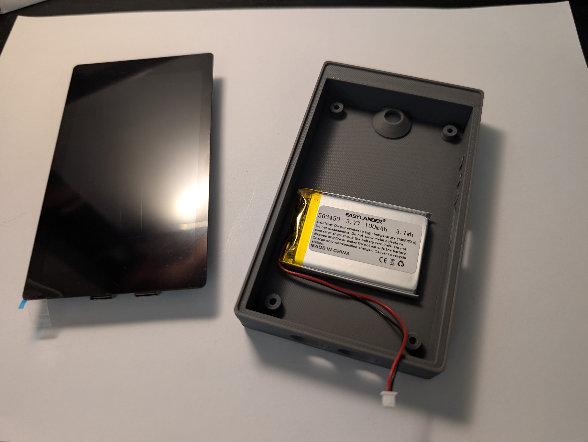

# Waveshare 4.3" Enclosure

A 3D-printable enclosure for the [Waveshare ESP32-P4-WiFi6-Touch-LCD-4.3](https://www.waveshare.com/esp32-p4-wifi6-touch-lcd-4.3.htm) development board (480x800 LCD). Designed with the [Kern](https://github.com/odudex/Kern) air-gapped Bitcoin signer project in mind, but suitable for any use case with this board.

## Files

| File | Description |
|---|---|
| KernWaveshare4.3.FCStd | Main FreeCAD source file |
| KernWaveshare4.3AlanKeyVariant.FCStd | Variant with hex socket head screw mounting |
| KernWaveshare4.3.3mf | Ready-to-slice 3D model |
| Button.FCStd | Separate button component |

## Printing

- **Material:** PLA
- **Layer height:** 0.2 mm
- **Infill:** 15% cross hatch
- **Orientation:** Print as designed (flat on build plate)

## Assembly

- Mount the board using **M2.5 screws** (6 mm or 8 mm length recommended)
- The enclosure has an outer protective rim that frames the 4.3" screen
- A **1000mAh battery** (model 503450, [available on AliExpress](https://aliexpress.com/item/1005008707394961.html)) fits well inside. Note: the units received are mislabeled as "100mAh" in the photos, but they are actually 1000mAh.

## Kern Project

This enclosure was designed for the [Kern](https://github.com/odudex/Kern) project, which uses the ESP32-P4 as an air-gapped Bitcoin signer. Kern supports the 4.3" Waveshare board as the wave_43 target. You can find build and flashing instructions in the [Kern README](https://github.com/odudex/Kern).

## License

This work is licensed under [CC BY-SA 4.0](https://creativecommons.org/licenses/by-sa/4.0/). If you remix, transform, or build upon this design, you must distribute your contributions under the same license.
